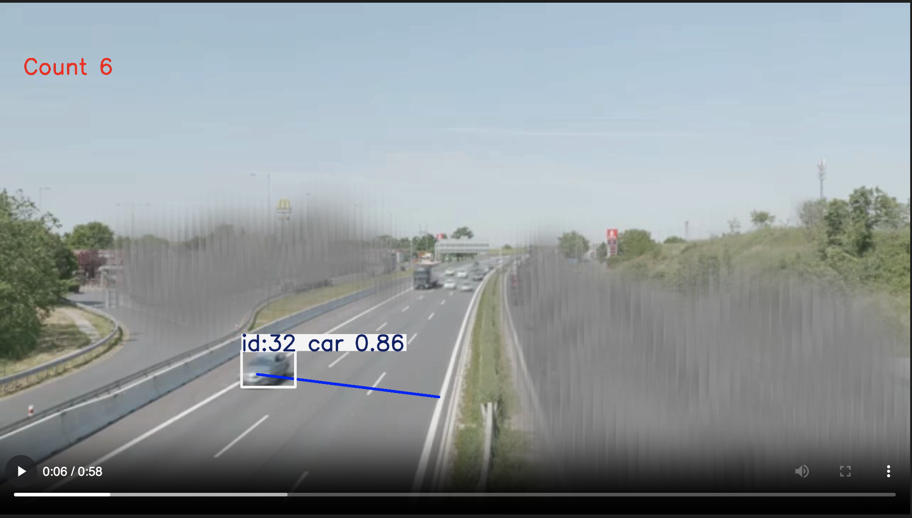
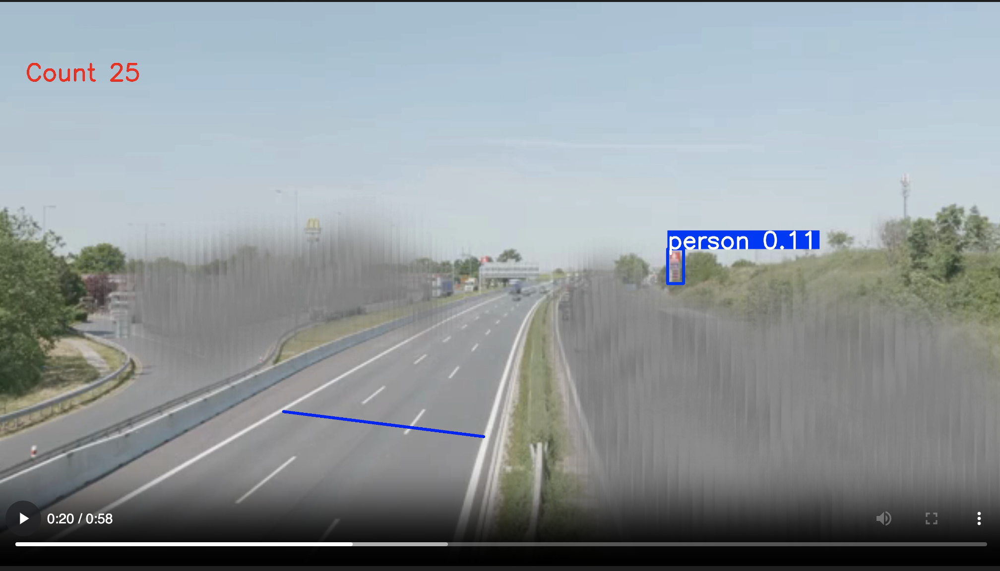
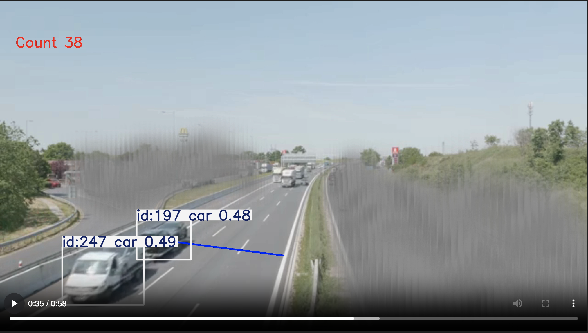

# Evaluation of Counting Video
| Segmentation | Time-frame | Manual Count | Model Count | Explanation | Image |
|---|---|---|---|---|---|
|Segmentation1| 0:00 - 0:10 |10   |  12 | In this sequence before car 7 passes the count line the count line is 6 and after it crosses the count line, the counter jumps form 7 to 9.| |
|Segmentation2| 0:10 - 0:20 |  22 | 25  | In this segmentation the counter increase randomly from 24 to 25.    |   |
|Segmentation3| 0:20 - 0:30 |  30 | 33  | Everything is consistently counted correctly.  |   |
|Segmentation4| 0:30 - 0:40 |  39 |  42 | In this segmentation there is a truck that has three vehihcles connected to it and when it crossed the counting line ther cars attacted were also counted. (this can be problematic in some situations)  ||  
|Segmentation5| 0:40 - 0:50 |  52 | 55  | Everything is consistently counted correctly.  |   |
|Segmentation6| 0:50 - 0:60 | 58  |  61  | Everything is consistently counted correctly.   |   |